## 1.前期准备

#### 1.1沙箱

沙箱是一个虚拟系统程序，允许你在沙盘环境中运行浏览器或其他程序，因此运行所产生的变化可以随后删除。它创造了一个类似沙盒的独立作业环境，在其内部运行的程序并不能对硬盘产生永久性的影响。其为一个独立的虚拟环境，可以用来测试不受信任的应用程序或上网行为。

**为测试和演示方便起见，本文采用沙箱环境演示支付宝接口中电脑网站支付部分。**

#### 1.2 如何使用沙箱环境

##### 1.2.1 注册登录支付宝开放平台   https://openhome.alipay.com/platform/banner.htm

##### 1.2.2 配置沙箱应用环境

点击“开放平台-开发者中心-[沙箱环境](https://openhome.alipay.com/platform/appDaily.htm)”。进入沙箱环境页面，系统已经自动为你创建一个应用，在基础信息中可以看到应用信息。

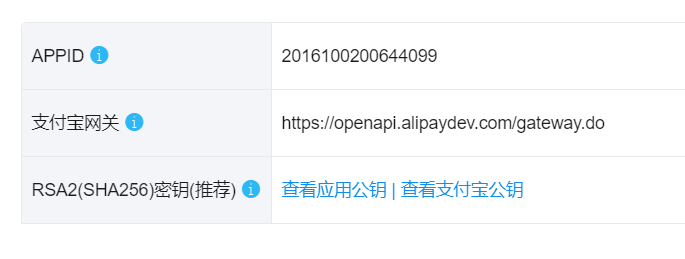

沙箱环境下APPID和支付宝网关已经给出，我们需要获取应用私钥和支付宝公钥（在调用接口时需将秘钥写入配置文件中）

##### 1.2.3获取秘钥

通过RSA签名验签工具来获取应用私钥和应用公钥，配置你的应用公钥后，会自动生成支付宝公钥，RSA签名验签工具在附件中上传，读者可自行下载。

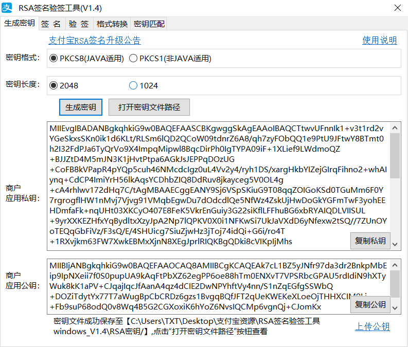

##### 1.2.4 沙箱钱包

为了爽一爽以及进行支付接口的调试，我们需要下载沙箱钱包

             

##### 1.2.5 踩坑分享

沙箱环境页面存在一个沙箱当面付接入引导链接，其中给出了下载支付宝秘钥生成器的方法。不要使用该生成器！此生成器只能生成应用公钥，而不能生成应用私钥，推荐使用编者附件中给出的工具。

PS：应用公钥无需写入配置文件中，只是用来生成支付宝公钥。

#### 1.3 环境配置

##### 1.3.1电脑网站支付Demo下载

支付宝开放平台中提供了各种各样的支付场景Demo，在顶部导航栏->文档中心->开发文档->了解产品处下载

     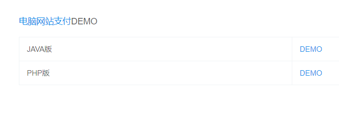

##### 1.3.2 IDEA环境配置

官方给出的Demo为eclipse项目，我们在配置时选择eclipse或maven皆可，配置过程并无太大差别，下面我们以配置maven项目为例来介绍。

PS：若选用eclipse项目，需要多出一步操作，在生成的web.xml中配置起始页。这是由于maven项目若未配置起始页则会默认起始页为index.jsp，而eclipse则会404。

1.创建一个空的maven项目

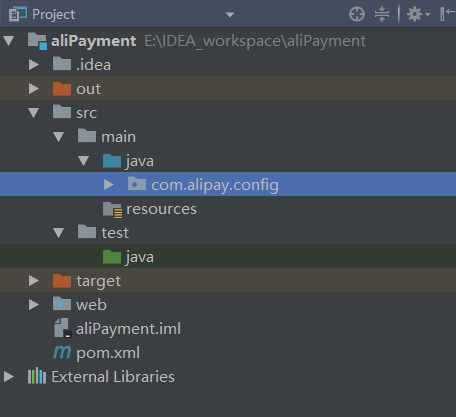

2.生成web.xml

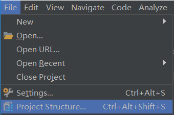

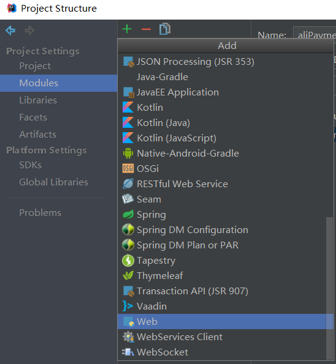

将新增加Web的Path设置为WEB-INF的web.xml文件，然后apply即可。

3.引入依赖

```xml
<dependency>
    <groupId>junit</groupId>
    <artifactId>junit</artifactId>
    <version>4.11</version>
    <scope>test</scope>
</dependency>
<dependency>
    <groupId>javax.servlet</groupId>
    <artifactId>jstl</artifactId>
    <version>1.2</version>
</dependency>
<dependency>
    <groupId>javax.servlet</groupId>
    <artifactId>javax.servlet-api</artifactId>
    <version>3.1.0</version>
</dependency>
```

4.指定maven打包的xml路径

```xml
<build>
    <finalName>aliPayment</finalName>
    <plugins>
        <plugin>
            <groupId>org.apache.maven.plugins</groupId>
            <artifactId>maven-war-plugin</artifactId>
            <version>2.2</version>
            <configuration>
                <webXml>web\WEB-INF\web.xml</webXml>
            </configuration>
        </plugin>
    </plugins>
</build>
```

5.将Demo中的config，jsp，jar分别复制到对应目录下，保持文件名和包名一致

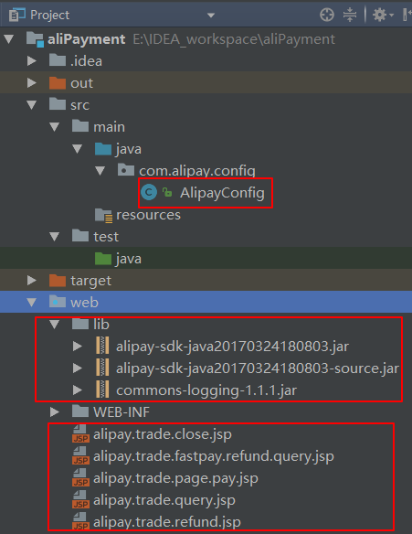

6.导入jar包

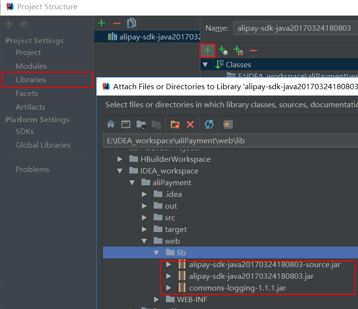

7.部署准备（项目打包）

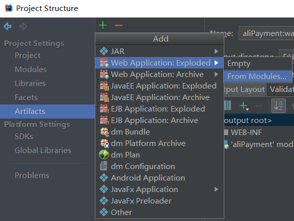

8.部署到tomcat服务器

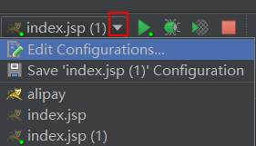

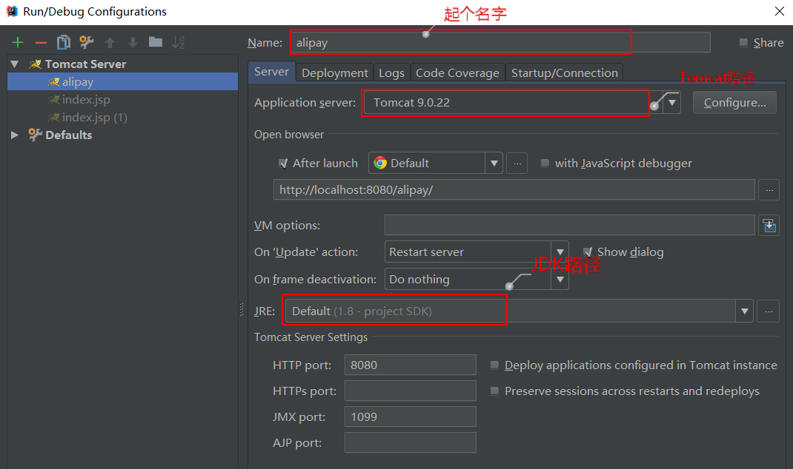

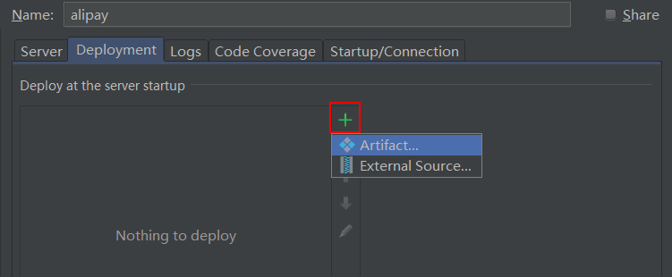

将Application context设置成和Name相同，然后apply。

9.启动tomcat运行Demo成功

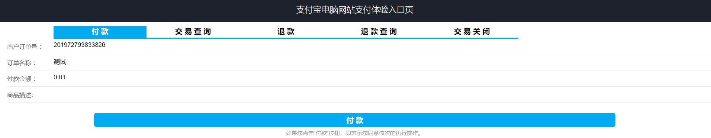

笔者在附件中提供了可直接运行的maven项目，如有需要可自行下载。

##### 1.3.3名词解释

sdk：软件开发工具包，在本文中为支付宝为我们提供的jar包，封装了了我们可直接使用的类。

jar：java文件的压缩包，可作为sdk使用

war：web文件的压缩包，javaWeb项目部署到服务器前要先打包成war包。

maven：框架的一种，特点是可以通过一小段描述信息来管理项目的构建，报告和文档。

##### 1.3.4 踩坑分享

除了上文提到的web.xml问题之外，最大的坑莫过于Demo中的read.txt，不仅没有参考价值还使得我走了不少弯路。首先在官方Demo中sdk是已经存在的无需下载（Demo中的两个jar包已经可以满足应用，如果需要深度研究，全部的sdk可在附件中下载），明显是项目更新后说明文档没有同步更新。然后java的read.txt提示让我把文件放入一个带有PHP字样的文件夹里，一度让过分相信说明文档的我懵逼了好久。In fact，这种漏洞百出的说明文档真不如不写。

还有一个比较有意思的坑，按照上文部署完后config文件会出现一个字符错误，只要新建一个一样的文件然后把原来那个删除就可以了。笔者猜想是由于Demo编码格式不为utf-8，或许将注释里的中文也报错了吧。

还有不要忘了填写配置文件，公私钥不要弄混。

## 2.代码讲解

受限于篇幅，笔者仅以应用最广泛的web线上扫码付款为例来讲解代码。

实际上，虽然各类软件功能上千差万别，可对于我们这些调用别人接口的菜鸟开发者而言，要做的事情都是大同小异的。不过对于安全要求极高的支付软件，接口的调用也会略有不同。

#### 2.1 代码分析

**统一收单下单并支付页面api：https://docs.open.alipay.com/api_1/alipay.trade.page.pay/**

虽然看起来参数列表很夸张，但实际上提供给我们的sdk已经封装好绝大部分了，只需要传少量必要的参数就能唤起支付页面，代码如下：

```java
//获得初始化的AlipayClient
AlipayClient alipayClient = new DefaultAlipayClient(AlipayConfig.gatewayUrl, AlipayConfig.app_id, AlipayConfig.merchant_private_key, "json", AlipayConfig.charset, AlipayConfig.alipay_public_key, AlipayConfig.sign_type);

//设置请求参数
AlipayTradePagePayRequest alipayRequest = new AlipayTradePagePayRequest();
alipayRequest.setReturnUrl(AlipayConfig.return_url);
alipayRequest.setNotifyUrl(AlipayConfig.notify_url);

//商户订单号，商户网站订单系统中唯一订单号，必填
String out_trade_no = new String(request.getParameter("WIDout_trade_no").getBytes("ISO-8859-1"),"UTF-8");
//付款金额，必填
String total_amount = new String(request.getParameter("WIDtotal_amount").getBytes("ISO-8859-1"),"UTF-8");
//订单名称，必填
String subject = new String(request.getParameter("WIDsubject").getBytes("ISO-8859-1"),"UTF-8");
//商品描述，可空
String body = new String(request.getParameter("WIDbody").getBytes("ISO-8859-1"),"UTF-8");

alipayRequest.setBizContent("{\"out_trade_no\":\""+ out_trade_no +"\"," 
                            + "\"total_amount\":\""+ total_amount +"\"," 
                            + "\"subject\":\""+ subject +"\"," 
                            + "\"body\":\""+ body +"\"," 
                            + "\"product_code\":\"FAST_INSTANT_TRADE_PAY\"}");
```


无非是将参数作为一个实例的属性构造实例，然后使用实例的方法访问支付宝。方法的参数是一个request请求实例，封装了公私钥等证明自己身份的信息。上面代码中的类都在支付宝sdk中有提供，感兴趣的同学可自行研究底层构造，这里不做过多阐述。

发送请求并唤起支付场景代码：

```java
String result = null;
try {
    result = alipayClient.pageExecute(alipayRequest).getBody();
} catch (AlipayApiException e) {
    e.printStackTrace();
}

//输出
out.println(result);
```

#### 2.2时序逻辑分析

调用时序图如下：

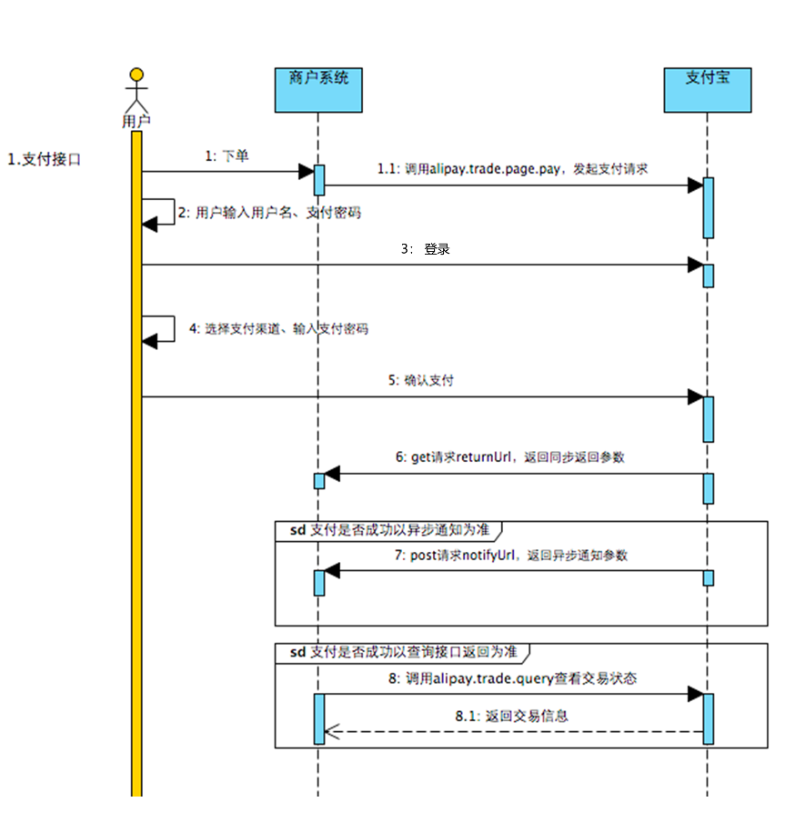

支付结果会异步通知我们的notify_url，这个地址需要我们自己根据业务逻辑设计（知道用户是否支付成功后前端提示不同的信息）

#### 2.3 总结

1.调用别人的接口使用并不是一件很困难的事情，大致都是配置参数--发送请求--获取响应--响应展示的流程，但每个软件也会有自己独特的业务逻辑，对于这些问题的处理还是需要经验的积累。

2.如果存在线上需求，只需要申请资格后修改一下沙箱环境的参数就可以了。

3.不要用沙盒钱包买早点。


​                                                          **作者：langzitan123  转载请注明出处**